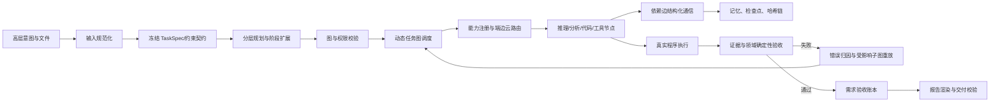

# 面向超长程复杂任务的动态异构群体智能架构与深度协同推理系统

## 技术方案与验收材料

> 本文面向 XH-202631 比赛评审，描述当前可运行实现、实验数据和复现方法。运行目录中的机器可读产物是验收事实的最终依据。

## 1. 项目摘要

本系统面向“输入异构、步骤超长、约束动态变化、交付物必须可验证”的复杂任务，构建了一个由 Python 确定性控制面和模型驱动执行面组成的动态群体智能框架。系统将高层意图编译为可增量扩展的任务图，根据能力、数据安全、位置、算力和历史质量动态选择执行资源；通过直接依赖通信、分层记忆和检查点保持长程一致性；通过真实代码执行、领域校验、证据核验和受影响子图重放形成无人工干预的闭环。

系统已在装箱、差旅报销、城市多模态治理三个场景通过独立审计，并完成城市真实业务千步任务和 MathorCup 千步候选优化任务。本文不把 1000 个 WorkUnit 宣称为 1000 次大模型调用，也不把逻辑端边云资源宣称为物理多机集群。

## 2. 需求与设计目标

任务书要求系统支持数千步复杂任务、多类型场景、动态稀疏拓扑、长程记忆、端边云资源选择、异常/需求变更/节点失效注入，以及从高层意图到最终交付物的全链路自动执行。对应目标为：

1. **可执行**：任务图、权限、状态、产物和报告均可落盘复现。
2. **可扩展**：新场景通过输入适配器、能力节点和领域校验器接入，不改动核心调度器。
3. **可验收**：结果由确定性校验器复算，证据引用使用 run_dir 相对路径。
4. **可恢复**：失败定位到代码节点或其后继子图，注入具体错误上下文并重执行，重试耗尽则明确失败。

## 3. 总体架构



控制面固定负责状态迁移、DAG 合法性、权限、资源过滤、持久化、领域验证和最终成功门禁；模型负责意图理解、候选计划、分析和代码建议。该“建议与控制分离”避免模型直接改变运行状态，是系统可信性的核心设计。

生命周期为：`prepare → classify → plan → execute → review → report → final_validate → finish`。主要实现分别位于 `orchestration/core/workflow.py`、`orchestration/graph/`、`orchestration/execution/` 和 `orchestration/validation/`。

## 4. 动态异构群体与任务图

规划器输出带能力标签、输入输出契约、资源约束和证据要求的语义节点。图编译器将其映射到可执行节点，并按阶段增量扩展需求前沿；调度器仅释放硬依赖已完成的节点。节点角色包括规划、检索、分析、代码生成、终端执行、验证、报告和治理节点，可由不同模型或工具实现。

任务图版本、节点状态、依赖边、输出摘要和 artifact 哈希均写入运行状态。已完成节点默认冻结，发生需求变更时只重开受影响节点及其后继，保持无关结果不变。

### 4.1 动态稀疏拓扑与路由伪代码

```text
function ROUTE(node, registry, history):
    C <- registry.match_capability(node.capability)
    C <- filter(C, available, concurrency, location,
                security >= node.security, compute >= node.compute,
                latency <= node.max_latency)
    for c in C:
        prior <- weighted_quality_cost_latency(c)
        observed <- history.score(c, node.task_type)
        confidence <- sample_confidence(history.count(c, node.task_type))
        c.score <- blend(prior, observed, confidence)
                     - failure_penalty(c.consecutive_failures)
    return argmax(C.score)
```

通信只沿直接依赖边发送，禁止全历史广播。消息包含 `source/target/node/type/summary/structured_output/evidence_refs/confidence/hash`；重复大对象外置为 SHA256 引用，文本经过字段投影和预算截断后再发送。

```text
function BUILD_MESSAGES(graph, completed):
    for edge (u -> v) in graph.edges:
        if u in completed and v is ready:
            payload <- project_required_fields(u.output, v.contract)
            payload <- externalize_duplicate(payload, sha256)
            envelope <- make_envelope(u, v, payload, evidence_refs)
            persist(envelope); deliver(v, envelope)
```

一次运行的拓扑密度为 0.17033（31 条实际边/182 条可能边），全历史广播为 0。该机制降低上下文噪声，并使证据来源可追溯。

## 5. 长程记忆与上下文唤醒

记忆分为工作记忆、情景记忆、语义记忆、程序记忆和 artifact 事实。SQLite 由 Python 管理写入；节点只能读取只读 `ContextCapsule`。核心目标、硬约束、数值、路径、哈希和证据引用属于受保护字段，不允许压缩器删除或改写。

唤醒评分综合相关性、时间新近度、重要性、DAG 距离和证据质量，先做确定性字段过滤，再进行可选文本压缩。运行 `20260903_160722` 生成 22 个 capsule，末 capsule 的 12 个关键字段全部保留（12/12），保护上下文完整性通过。城市千步运行在第 500 步从 checkpoint 20 恢复，重复执行为 0。

```text
function WAKE(goal, node, memory):
    protected <- memory.protected(goal, node.constraints)
    candidates <- memory.retrieve(relevance + recency + importance
                                  + dag_proximity + evidence_quality)
    capsule <- cap_tokens(protected + top_k(candidates))
    assert contains_all(capsule, protected)
    return readonly(capsule)
```

## 6. 端边云协同与多模型路由

`ResourceRegistry` 将 device、edge、cloud 抽象为可替换资源描述符，记录算力、延迟、成本、安全等级、并发和可用性。默认策略是：端侧做本地解析和敏感执行，边侧做常规分析与校验，云侧承担全局规划和复杂推理。安全等级、位置和可用性是硬过滤条件，价格不能突破保密约束。

当前配置可将端/边阶段路由到 `qwen3.5-flash`，云阶段路由到 `qwen3.5-35b-a3b`，模型名、资源 ID、候选回退和路由原因写入证据。该实现是**逻辑资源后端与阶段级推理切分**，不是 Transformer 参数层切分，也不宣称已有真实物理多机集群；资源失效时可在同一合法约束下切换候选资源。

## 7. 可信执行、领域验收与自主修复

代码节点必须在受控终端真实执行并生成结构化产物。以 MathorCup 为例，`result.json` 契约包含 `vehicle_scenarios`、`multi_vehicle_scenarios`、`placements`、`vehicle_count`、`total_cost`、两类利用率和 `validation`。Python 确定性校验器复算：货物类型与数量覆盖、坐标边界、三维 AABB 重叠、易碎件堆叠、顶部间隙、重量上限、利用率 [0,1]、车辆数和成本。

证据统一使用 run_dir 相对路径：`artifacts/result.json`、`artifacts/tool_results/terminal_execution/terminal_execution.json`，并额外生成 `result_complete.json`、`constraint_validation_log.json`、`cost_comparison.json`。需求验收、证据核验和报告生成均是硬门禁，任何失败都不能伪造成功。

```text
function REPAIR_LOOP(validation, graph, budget):
    while validation.failed and budget > 0:
        issues <- classify(validation.errors)
        owners <- attribute_to_code_or_execution_node(issues)
        affected <- owners + descendants(owners)
        inject(affected, exact_error_context(issues))
        reopen(affected); execute(affected)
        refresh_all_artifacts_and_hashes()
        validation <- deterministic_validate()
        budget <- budget - 1
    return validation
```

错误类型覆盖模型格式、编译、进程、领域约束、证据和验收失败；重试耗尽时记录明确 failed 状态。当前优先复用已有 code 节点，只有在需要专门算法策略时才引入受约束的 AlgorithmRepairAgent。

## 8. 动态注入与无人工干预恢复

`recovery-demo` 在主调度器内注入三类事件：节点失效、需求变更和数据异常。状态序列分别为 `triggered → detected → recovery_started → recovered`；数据异常通过 SHA256 检测、隔离、字节级恢复后重试。事件追加到 `run_state.json.runtime_injections` 和正常事件流，任何未恢复事件都会阻断最终交付。

## 9. 实验与可复现证据

以下运行均通过 `utils/run_audit.py` 的 9/9 审计：

| 场景 | 运行目录 | 关键结果 |
|---|---|---|
| MathorCup D | `outputs/runs/20260908_124006` | 300 件货物、约束校验、9/9 PASS |
| 差旅报销 | `outputs/runs/20260908_125323` | 5 条费用、CNY 1,485、异常识别、9/9 PASS |
| 城市多模态 | `outputs/runs/20260908_173502` | 遥感 511、法规 80,000、通联 80,000、PCAP 500,000、9/9 PASS |
| 城市真实业务千步 | `outputs/runs/20260909_urban_business_1000` | 1,000 WorkUnit（900 来源+100 融合）、10 次阶段模型调用、40 checkpoints、第 500 步恢复、0 重复 |
| 动态注入恢复 | `outputs/runs/20260910_163108` | 三类注入全部 recovered |
| MathorCup 千步优化 | `outputs/runs/20260911_mathorcup_business_1000` | 1,000 候选评估、300 件货物覆盖、5 车、成本 3500、40 checkpoints、独立领域验证通过 |

城市数据范围如实限定为遥感元数据/caption、PCAP 包头解析，不进行个人身份关联或因果推断。MathorCup 千步为确定性候选搜索，不能表述为 1000 次大模型调用。

## 10. 复杂度分析

设图节点数为 `V`、边数为 `E`、候选资源数为 `C`、记忆记录数为 `R`、产物字节数为 `B`、摆放数为 `P`：

| 模块 | 时间复杂度 | 空间复杂度 |
|---|---:|---:|
| DAG 合法性检查 | `O(V+E)` | `O(V+E)` |
| 资源过滤与排序 | `O(C)`、`O(C log C)` | `O(C)` |
| 稀疏消息构建 | `O(E+B)` | 单节点预算有界 |
| 哈希与产物刷新 | `O(B)` | `O(产物数)` |
| 记忆检索 | `O(R)`（索引后约 `O(K log R)`） | `O(K)` |
| checkpoint 序列化 | `O(V+E+state)` | 同阶 |
| 受影响子图重放 | `O(V'+E')` | `O(V'+E')` |
| MathorCup AABB 校验 | 最坏 `O(P²)` | `O(P)` |

当前调度器采用保守扫描，最坏可达 `O(V²+E)`；千步测试通过批量状态写入、目录扫描上限、原子替换和记忆祖先深度上限保持稳定。后续可用优先队列进一步降低重复扫描成本。

## 11. 部署与复现

```bash
conda activate agent
python -m pip install -r requirements.txt
python main.py --input examples/mathorcup_d
python main.py --input examples/expense_reimbursement
python main.py --input 城市多模态数据集
python utils/run_audit.py outputs/runs/<run_id>
```

提交包由 `utils/package_submission.py` 生成，仅接收完整审计通过的运行，并扫描文本中的密钥模式。API Key 只通过环境变量注入，不写入运行产物。

## 12. 任务书评分映射与能力边界

| 评分项 | 本系统对应证据 |
|---|---|
| 系统基础与闭环（15） | 任务图、真实执行、领域/证据/需求三重门禁、最终报告 |
| 组织架构与协作（15） | 异构能力节点、稀疏依赖通信、动态路由、记忆胶囊 |
| 多场景演示（10） | 装箱、报销、城市多模态及两项千步运行 |
| 应用创新（25） | 跨模态城市治理、可审计业务结果、低人工介入 |
| 技术创新（20） | 控制面/模型面分离、拓扑稀疏化、受保护记忆、业务驱动修复 |
| 性能效率（15） | 资源硬约束路由、checkpoint 恢复、Token/延迟/成功率指标 |

需要在现场明确的边界：端边云为逻辑资源调度；推理切分为阶段级而非参数级；城市遥感与 PCAP 分析使用元数据/包头；千步指标按 WorkUnit 或候选评估计数，模型调用次数单独报告。上述边界不影响已实现的可运行闭环，但应避免不实承诺。

## 13. 结论

系统已形成从意图解析、动态规划、异构路由、长程记忆、真实执行、领域验收、证据闭合到报告交付的完整工程链路，并在多场景和千步任务上留下可复核证据。其主要创新是把模型的开放式推理能力置于可验证控制面之内：模型负责提出方案，确定性组件负责约束、执行、复算和裁决。该架构为后续接入更多模型、真实边缘节点和更高效的并行调度保留了清晰扩展点。

## 附录 A：关键数据结构与状态契约

### A.1 TaskSpec 与 Requirement Contract

系统首先把用户输入冻结为 `TaskSpec`。该对象至少包含任务目标、输入文件清单、约束集合、交付物类型、隐私等级、预算、截止时间、允许资源位置和验收规则。冻结后生成不可变的 `requirement_digest`，后续每个节点和 checkpoint 都保存该摘要，防止长程执行中目标漂移。

`Requirement Contract` 将自然语言要求转换为机器可检查条目，每条包含：`requirement_id`、`description`、`owner_node`、`acceptance_test`、`evidence_refs`、`status`。只有所有硬性条目为 `passed`，系统才允许进入报告阶段。

### A.2 WorkUnit 与事件日志

长程任务被拆成可重放的 WorkUnit。WorkUnit 包含唯一 ID、输入范围、前置节点、执行资源、尝试次数、输出摘要、artifact 哈希、开始/结束时间和状态。事件日志采用追加写入，记录 `planned、ready、running、succeeded、failed、reopened、recovered` 等状态迁移；任何状态变化均可由事件重建。

### A.3 证据闭合规则

证据采用“声明—直接依赖—文件—哈希”四元组。声明只能引用产生该事实的节点或其直接验证节点，路径统一为运行目录相对路径。关键业务事实分别落在 `result_complete.json`、`constraint_validation_log.json` 和 `cost_comparison.json`，避免验证器从超大文本中猜测结论。证据缺失、路径越界、哈希不匹配或引用非直接依赖节点，均会使 `evidence_verification.passed=false`。

## 附录 B：MathorCup 领域验收说明

MathorCup 插件以车辆尺寸、载重、货物类型、数量、尺寸、重量、易碎属性和间隙约束为输入，输出统一 JSON。确定性校验分为四层：

1. **模式层**：检查字段类型、必填字段、数值非负和枚举合法性。
2. **覆盖层**：按货物类型聚合 placement 数量，与需求清单逐项比较，禁止漏件、重复件或未知类型。
3. **几何层**：验证坐标边界、旋转尺寸、三维 AABB 不重叠、顶部间隙和易碎件底层约束。
4. **运营层**：复算车辆载重、空间利用率、车辆数量和总成本，并检查利用率位于 `[0,1]`。

最终结果中的车辆数和成本不接受模型自报值，而是从通过校验的实际 placements 和车辆分配中重新计算。该设计直接解决了早期运行中的坐标越界、利用率超过 100%、数量覆盖不完整和成本字段缺失问题。

## 附录 C：异常恢复时序

```text
检测器发现异常
    -> 记录原始错误与输入摘要
    -> 根据 artifact/node_id 归因责任节点
    -> 仅重开责任节点及后继节点
    -> 将 boundary/index/expected/actual 等具体上下文注入修复提示
    -> 重新生成代码或选择确定性领域插件
    -> 重新执行终端脚本并刷新全部产物
    -> 重新进行业务验证、证据验证和需求验收
    -> 通过则生成报告；预算耗尽则明确失败
```

节点失效恢复使用资源候选切换；需求变更恢复递增图版本并冻结无关节点；数据异常恢复保留原始副本、隔离损坏文件并通过哈希确认恢复结果。三类事件均不依赖人工点击确认。

## 附录 D：实验指标解释与复现实验设计

为避免“步数”和“模型调用”混淆，系统在指标中分开记录 `work_unit_count`、`model_call_count`、`checkpoint_count`、`replay_count` 和 `token_usage`。城市千步运行的 1000 个 WorkUnit 包含 900 个来源处理单元和 100 个跨模态综合单元，其中 10 个综合阶段调用真实模型；MathorCup 千步运行是 1000 个确定性候选生成与评估单元。

建议现场按以下顺序演示：先打开任务图和资源路由，再展示一个代码节点生成的结构化结果，随后打开领域约束日志和成本复算文件，最后触发一次节点失效或需求变更，观察局部重放、checkpoint 更新和最终报告生成。演示过程中展示 `run_state.json`、`agent_trace.md` 和 `review/validation_report.md` 的对应时间线，可使评委同时看到中间决策、推理轨迹和验收闭环。

## 附录 E：创新性与可推广性论证

本系统的创新不是简单增加 Agent 数量，而是将群体协作从“全历史对话”转化为可度量的依赖图通信：节点只接收完成当前任务所需的字段，通信关系由任务语义和硬依赖动态决定。第二项创新是受保护记忆胶囊，关键约束与证据引用具有不可丢失属性，普通上下文才允许压缩。第三项创新是把领域校验器作为控制面的一等公民，使错误能够反向定位至代码节点并触发局部修复，而不是重新运行全部流程。

该模式可迁移到报销审核、城市治理、物流规划、科研数据处理等任务：新增场景只需提供输入解析器、领域结果契约和确定性验收函数，调度、记忆、证据和恢复基础设施保持不变。对于更大规模部署，可将逻辑资源描述符绑定到真实边缘设备、容器或远程 OpenAI-compatible 服务，并将当前保守扫描调度器替换为优先队列或分布式调度器。

## 附录 F：提交与答辩风险控制

- 所有截图和录屏必须显示运行 ID、最终状态和审计结果，避免只展示模型生成文本。
- 端边云部分使用“逻辑资源后端、阶段级路由”表述，不使用“真实多机集群”或“参数级切分”表述。
- 千步结果按 WorkUnit/候选评估计数，模型调用次数单独列出。
- 城市多模态部分明确遥感为元数据/caption、PCAP 为包头统计，不延伸到个人身份识别。
- 提交前运行 `utils/run_audit.py`，只有 9/9 PASS 的目录进入提交包；任何失败运行只能作为修复过程证据，不能作为成功案例宣传。
